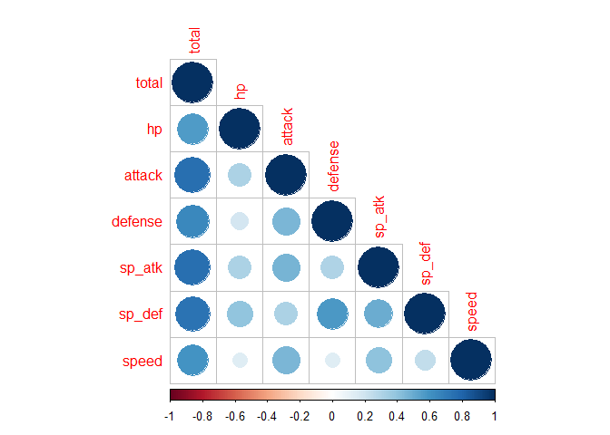
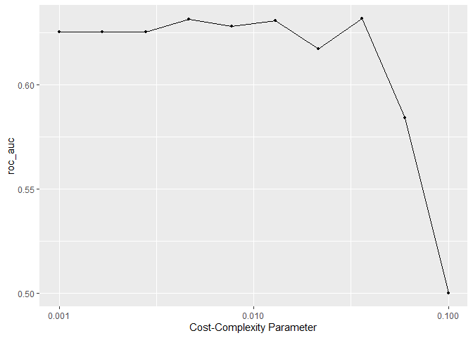
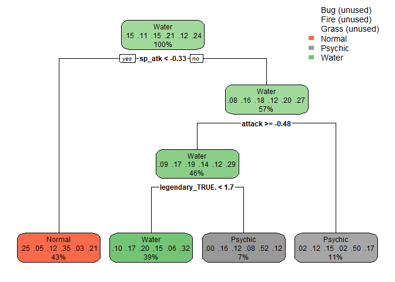
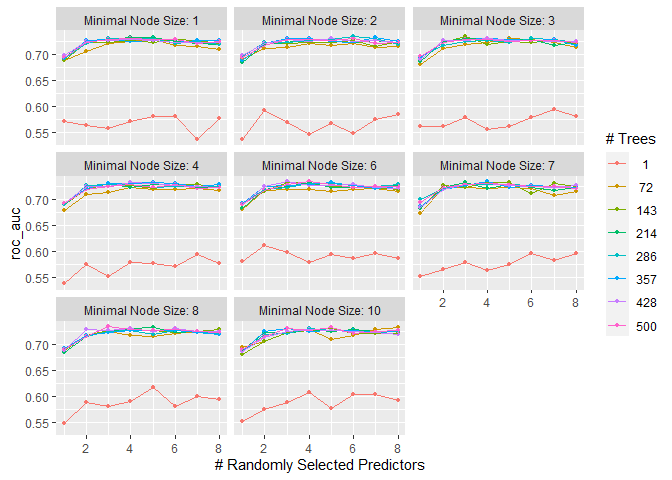
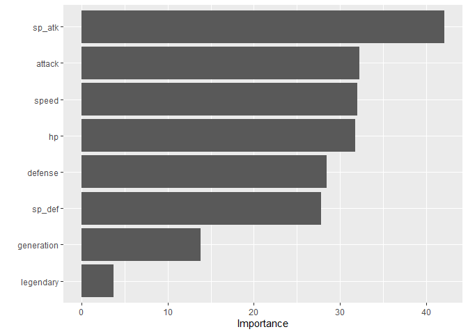
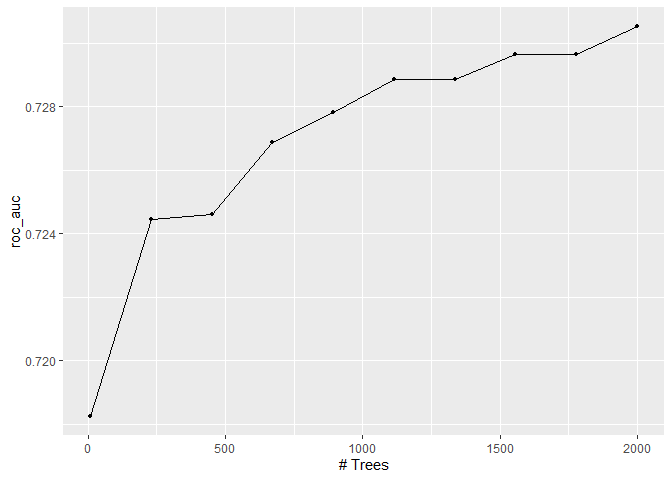
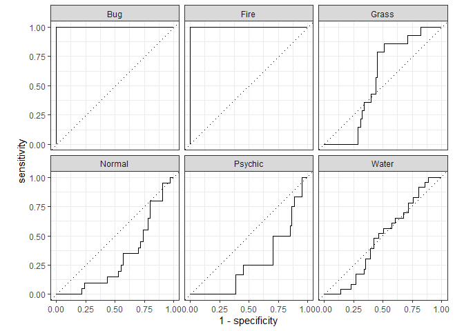
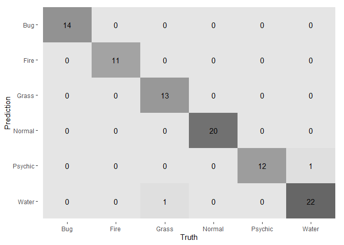

Homework Six: Tree-Based Models
================
Carly Greutert

1.  

``` r
library(janitor)
pokemon <- clean_names(pokemon_old)
pokemon <- filter(pokemon, type_1=="Bug" | type_1=="Fire" | type_1=="Grass" | type_1=="Normal" | type_1=="Water" | type_1=="Psychic")
names <- c('type_1', 'legendary')
pokemon[,names] <- lapply(pokemon[,names], factor)
pokemon$generation <- as.factor(pokemon$generation)
set.seed(777)
pokemon_split <- initial_split(pokemon, prop = 0.80, strata = 'type_1')
pokemon_train <- training(pokemon_split)
pokemon_test <- testing(pokemon_split)
pokemon_folds <- vfold_cv(pokemon_train, v = 5, strata=type_1)
pokemon_recipe <- recipe(type_1 ~ legendary + generation + sp_atk + attack + speed + defense + hp + sp_def, pokemon_train) %>% 
  step_dummy(legendary) %>%
  step_dummy(generation) %>%
  step_normalize(all_predictors())
pokemon_formula <- formula(type_1 ~ legendary + generation + sp_atk + attack + speed + defense + hp + sp_def, pokemon_train) %>% 
  step_dummy(legendary) %>%
  step_dummy(generation) %>%
  step_normalize(all_predictors())
```

2.  

``` r
pokemon_train %>% 
  select(where(is.numeric), -number) %>%
  cor() %>% 
  corrplot(type = "lower")
```

<!-- -->

I decided to only select the numeric variables in calculating
correlations since I want to visualize the linear relations between each
variable. I also deleted the number/id variable since it is not useful
in determining the strength of a pokemon and just functions as an
identifier. I notice that most variables are strongly correlated with
the total variable, which makes sense that the stronger battle stats you
have, the higher total strength a pokemon has. I also notice that attack
and defense are correlated with special attack and defense,
respectively. This also makes sense that the higher baseline
attack/defense a pokemon has, the higher chance it will also be more
equipped against special attacks and defenses from other pokemon.

3.  

``` r
tree_spec <- decision_tree() %>%
  set_engine("rpart") %>%
  set_mode("classification")
  
tree_wf <- workflow() %>%
add_model(tree_spec %>% 
set_args(cost_complexity = tune())) %>%
add_recipe(pokemon_recipe)

param_grid <- grid_regular(cost_complexity(range = c(-3, -1)), levels = 10)

tune_res <- tune_grid(
  tree_wf, 
  resamples = pokemon_folds, 
  grid = param_grid, 
  metrics = metric_set(roc_auc)
)
autoplot(tune_res)
```

<!-- -->

I observe that a smaller complex penalty yields a better performance for
a single tree, however it looks like the peak is right before the
penalty becomes too large.

4.  

``` r
tune_res %>% 
  collect_metrics() %>%
  arrange(desc(mean))
```

    ## # A tibble: 10 x 7
    ##    cost_complexity .metric .estimator  mean     n std_err .config              
    ##              <dbl> <chr>   <chr>      <dbl> <int>   <dbl> <chr>                
    ##  1         0.0359  roc_auc hand_till  0.632     5  0.0201 Preprocessor1_Model08
    ##  2         0.00464 roc_auc hand_till  0.631     5  0.0261 Preprocessor1_Model04
    ##  3         0.0129  roc_auc hand_till  0.631     5  0.0184 Preprocessor1_Model06
    ##  4         0.00774 roc_auc hand_till  0.628     5  0.0247 Preprocessor1_Model05
    ##  5         0.001   roc_auc hand_till  0.626     5  0.0272 Preprocessor1_Model01
    ##  6         0.00167 roc_auc hand_till  0.626     5  0.0272 Preprocessor1_Model02
    ##  7         0.00278 roc_auc hand_till  0.626     5  0.0272 Preprocessor1_Model03
    ##  8         0.0215  roc_auc hand_till  0.617     5  0.0160 Preprocessor1_Model07
    ##  9         0.0599  roc_auc hand_till  0.584     5  0.0230 Preprocessor1_Model09
    ## 10         0.1     roc_auc hand_till  0.5       5  0      Preprocessor1_Model10

The roc_auc of my best-performing pruned decision tree on the folds is
0.6317448.  
5.

``` r
best_roc_auc <- select_best(tune_res)

class_tree_final <- finalize_workflow(tree_wf, best_roc_auc)

class_tree_final_fit <- fit(class_tree_final, data = pokemon_train)

class_tree_final_fit %>%
  extract_fit_engine() %>%
  rpart.plot(roundint= FALSE)
```

<!-- -->

6.  

``` r
forest_spec <- rand_forest(min_n = tune(), trees = tune(), mtry=tune()) %>%
  set_engine("ranger", importance = 'impurity') %>%
  set_mode("classification")

forest_wf <- workflow() %>%
  add_model(forest_spec) %>% 
  add_recipe(pokemon_recipe)

param_grid2 <- grid_regular(min_n(range = c(1,10)), trees(range = c(1,500)), mtry(range = c(1,8)), levels= 8)
```

The hyperparameter mtry represents the random sample of the number of
predictors for each split/fold while creating the tree models that
populate the forest. The hyperparameter trees represents how many trees
should be included in the forest and min_n represents the number of
observations in order for a node to be split/folded further. The
hyperparameter mtry must be between 1 and 8 because there are only 8
predictors in our recipe. If mtry=8, the model is a bagged model.

7.  

``` r
tune_res2 <- tune_grid(
  forest_wf, 
  resamples = pokemon_folds, 
  grid = param_grid2, 
  metrics = metric_set(roc_auc)
)
autoplot(tune_res2)
```

<!-- -->

I notice that a fewer number of trees yields a higher roc_auc. Also, it
seems like minimal node size does not influence accuracy significantly
except in the case of 500 trees it changes greatly. Furthermore, it
seems like 4-6 randomly selected predictors yields the highest results.

8.  

``` r
tune_res2 %>% 
  collect_metrics() %>%
  arrange(desc(mean))
```

    ## # A tibble: 512 x 9
    ##     mtry trees min_n .metric .estimator  mean     n std_err .config             
    ##    <int> <int> <int> <chr>   <chr>      <dbl> <int>   <dbl> <chr>               
    ##  1     3   500     8 roc_auc hand_till  0.735     5 0.00825 Preprocessor1_Model~
    ##  2     4   500     6 roc_auc hand_till  0.735     5 0.00805 Preprocessor1_Model~
    ##  3     4   357     7 roc_auc hand_till  0.734     5 0.00701 Preprocessor1_Model~
    ##  4     3   428     6 roc_auc hand_till  0.734     5 0.00758 Preprocessor1_Model~
    ##  5     3   143     3 roc_auc hand_till  0.734     5 0.0104  Preprocessor1_Model~
    ##  6     6   286     2 roc_auc hand_till  0.733     5 0.00756 Preprocessor1_Model~
    ##  7     4   214     6 roc_auc hand_till  0.733     5 0.00605 Preprocessor1_Model~
    ##  8     8    72    10 roc_auc hand_till  0.733     5 0.00548 Preprocessor1_Model~
    ##  9     5   143     7 roc_auc hand_till  0.733     5 0.00577 Preprocessor1_Model~
    ## 10     5   357     6 roc_auc hand_till  0.733     5 0.00767 Preprocessor1_Model~
    ## # ... with 502 more rows

The roc_auc of my best-performing random forest model on the folds is
0.7371432.

9.  

``` r
best_forest <- select_best(tune_res2)

forest_fit <- finalize_model(forest_spec, best_forest)

forest_final_fit <- fit(forest_fit, type_1 ~ legendary + generation + sp_atk + attack + speed + defense + hp + sp_def, data = pokemon_train)

vip(forest_final_fit)
```

<!-- -->

Generation and legendary seem to be the least important. All others seem
relatively equal in importance, except for sp_attack which seems to be
most important. I’m not surprised sp_attack is the most important since
that seems most diverse with respect to the type of pokemon. I am not
surprised that non-battle related statistics have little importance.

10. 

``` r
boost_spec <- boost_tree(trees = tune()) %>%
  set_engine("xgboost") %>%
  set_mode("classification")

boost_wf <- workflow() %>%
  add_model(boost_spec) %>% 
  add_recipe(pokemon_recipe)

param_grid3 <- grid_regular(trees(range = c(10, 2000)), levels= 10)

tune_res3 <- tune_grid(
  boost_wf, 
  resamples = pokemon_folds, 
  grid = param_grid3, 
  metrics = metric_set(roc_auc)
)

autoplot(tune_res3)
```

<!-- -->

``` r
tune_res3 %>% 
  collect_metrics() %>%
  arrange(desc(mean))
```

    ## # A tibble: 10 x 7
    ##    trees .metric .estimator  mean     n std_err .config              
    ##    <int> <chr>   <chr>      <dbl> <int>   <dbl> <chr>                
    ##  1  2000 roc_auc hand_till  0.731     5 0.0112  Preprocessor1_Model10
    ##  2  1557 roc_auc hand_till  0.730     5 0.0110  Preprocessor1_Model08
    ##  3  1778 roc_auc hand_till  0.730     5 0.0113  Preprocessor1_Model09
    ##  4  1336 roc_auc hand_till  0.729     5 0.0111  Preprocessor1_Model07
    ##  5  1115 roc_auc hand_till  0.729     5 0.0108  Preprocessor1_Model06
    ##  6   894 roc_auc hand_till  0.728     5 0.0108  Preprocessor1_Model05
    ##  7   673 roc_auc hand_till  0.727     5 0.0111  Preprocessor1_Model04
    ##  8   452 roc_auc hand_till  0.725     5 0.0109  Preprocessor1_Model03
    ##  9   231 roc_auc hand_till  0.724     5 0.0121  Preprocessor1_Model02
    ## 10    10 roc_auc hand_till  0.718     5 0.00735 Preprocessor1_Model01

I notice the higher number of trees, the higher the roc_auc. The roc_auc
of my best-performing boosted tree model on the folds is 0.7305239.

11. 

``` r
fst <- as.data.frame(arrange(collect_metrics(tune_res), desc(mean))[1,4])
snd <- as.data.frame(arrange(collect_metrics(tune_res2), desc(mean))[1,6])
trd <- as.data.frame(arrange(collect_metrics(tune_res3), desc(mean))[1,4])
rtbl <- rbind(fst, snd, trd)
row.names(rtbl)<- c("pruned tree", "random forest", "boosted tree")
rtbl
```

    ##                    mean
    ## pruned tree   0.6317448
    ## random forest 0.7346874
    ## boosted tree  0.7305239

``` r
wf_final <- finalize_workflow(forest_wf, best_forest)
model_final <- fit(wf_final, data = pokemon_test)

augment(model_final, new_data = pokemon_test) %>%
  roc_auc(type_1, estimate = c(.pred_Bug, .pred_Fire, .pred_Water, .pred_Grass, .pred_Normal, .pred_Psychic))
```

    ## # A tibble: 1 x 3
    ##   .metric .estimator .estimate
    ##   <chr>   <chr>          <dbl>
    ## 1 roc_auc hand_till      0.609

``` r
augment(model_final, new_data = pokemon_test) %>%
roc_curve(type_1, estimate = c(.pred_Bug, .pred_Fire, .pred_Water, .pred_Grass, .pred_Normal, .pred_Psychic)) %>%
autoplot()
```

<!-- -->

``` r
augment(model_final, new_data = pokemon_test) %>%
  conf_mat(truth = type_1, estimate = .pred_class) %>% 
  autoplot(type = "heatmap")
```

<!-- -->

My random forest was my best performing model. My model was most
accurate at predicting normal and water and was the worst at predicting
fire and psychic.
